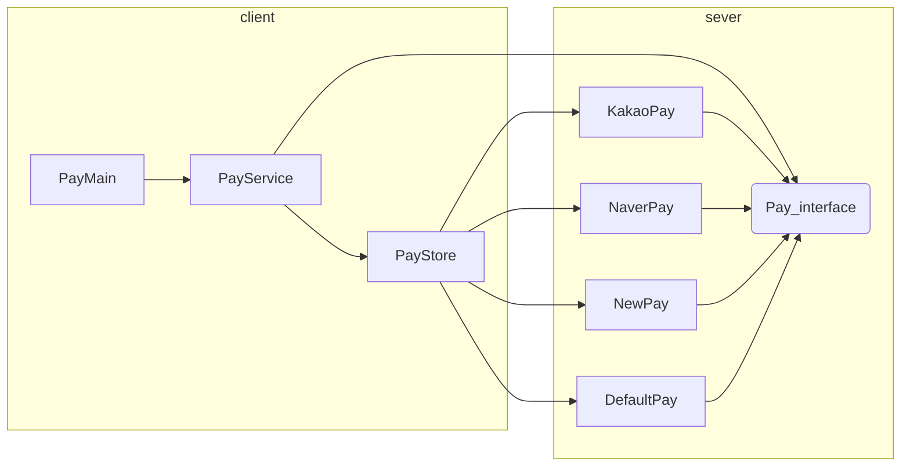

[<back](https://www.notion.so/basic-_-3ee7f95ac24d43f881b7ee2e8f21c210?pvs=21)

---

<aside>
📃 목차

</aside>

---

# 좋은 객체 지향 프로그램이란?

<aside>
🧱 **객체 지향 특징**

- 추상화
- 캡슐화
- 상속
- **다형성 → 가장 중요**
</aside>

## 객체 지향 프로그래밍

- 컴퓨터 프로그램을 명령어의 목록으로 보는 시각에서 벗어나 여러개의 독립된 단위, 즉 “객체”들의 모임으로 파악하고자 하는것.
- 각각의 객체는 메시지를 주고 받고, 데이터를 처리할 수 있다.(협력)
- 프로그램을 유연하고 변경 용이하게 만들기 때문에 대규모 소프트웨어 개발에 많이 사용됨.

### **유연하고, 변경이 용이하다?**

- 레고 블럭 조립하듯.
- 키보드, 마우스 갈아 끼우듯.
- 컴퓨터 부품 갈아 끼우듯.
- 컴포턴트를 쉽고, 유연하게 변경하면서 개발 할 수 있는 방법

## 다형성

### **다형성의 실세계 비유**

- **역할**과 **구현**으로 비유

  

  - 운전자 입장에서 자동차를 바꿔도 바로 적용가능.
  - 클라이언트는 기본적인 역할만 알면 다른 자동차를 운전할 수 있다.
    - 클라이언트는 자동차의 구현에 대해 알 필요 없다.
    - 자동차의 역할만 알면 다른 자동차를 타도 운전하는데 동일하다.
  - **역할과 구현을 구분**해 놓으니 다른 자동차가 구현되어도 자동차의 기본적 역할만 알면 **클라이언트는 어떻게 구현된 자동차도 운전 가능**하다.

  

  - 역할만 알고 있으면, 누가 역할을 하는지 몰라도 된다.
  - 구현의 변경이 클라이언트에 영향을 주지 않는다.
  - **역할과 구현을 구분**해 놓으니 다른 배우가 역할을 수행해도 기본적 역할만 알면 **클라이언트는 어떻게 구현해도 공연이 가능**하다.

### 역할과 구현을 분리

- **역할**과 **구현**으로 구분하면 세상이 단순해지고, 유연해지며 변경도 편리
- **장점**
  - **클라이언트**는 **대상의 역할(인터페이스)**만 알면 된다.
  - **클라이언트**는 **구현 대상의 내부 구조를 몰라도** 된다.
  - **클라이언트**는 구현 대상의 **내부 구조가 변경**되어도 영향 받지 않음.
  - **클라이언트**는 구현 **대상 자체를 변경**해도 영향 받지 않음.
- **한계**
  - 역할(인터페이스)자체가 변하면, 클라이언트, 서버 모두 큰 변경이 발생.
    - 자동차 → 비행기가 된다면?
    - 대본 자체가 변경된다면?
    - usb 인터페이스 변경된다면?
  - 따라서, 안정적으로 잘 설계하는 것이 중요

- **자바언어의 다형성 활용**
  - 역할 = 인터페이스
  - 구현 = 인터페이스를 구현한 클래스, 구현 객체
- 객체를 설계할 때 **역할**과 **구현**을 명확히 분리
- 객체 설계 시 역할(인터페이스)를 먼저 부여하고, 그 역할을 수행하는 구현 객체 만들기

### 객체의 협력이라는 관계부터 생각

- 클라이언트: **요청**, 서버: **응답**
- 수 많은 객체 클라이언트와 객체 서버는 서로 협력 관계를 가진다.


### 자바 언어의 다형성


- 오버라이딩
  - 오버라이딩 된 메서드 실행
  - 다형성으로 인터페이스를 구현한 객체를 실행 시점에 유연하게 변경 가능
  - 클래스 상속 관계도 다형성, 오버라이딩 적용 가능


### 다형성의 본질

- 인터페이스를 구현한 객체 **인스턴스를 실행 시점**에 **유연하게 변경 가능.**
- 다형성의 본질을 이해하려면 **협력**이라는 객체사이의 관계에서 시작.
- **클라이언트 코드를 변경하지 않고, 서버의 구현 기능을 유연하게 변경 가능.**

### 정리

- 다형성이 가장 중요
- 디자인 패턴 대부분은 다형성을 활용하는 것
- 스프링 핵심인 제어의 역전(IoC), 의존관계 주입(DI)도 결국 다형성을 활용

## 다형성 - 역할과 구현 예제1

간단한 운전자와 자동차의 관계 개발. 먼저 다형성을 사용하지 않고 역할고 구현을 분리하지 않고 단순 개발

`Driver` 는 `K3Car`를 운전하는 프로그램


**K3car**

```java
package poly.car0;

public class K3Car {
    public void startEngine() {
        System.out.println("K3Car.startEngine");
    }

    public void offEngine() {
        System.out.println("K3Car.offEngine");
    }

    public void pressAccelerator() {
        System.out.println("K3Car.pressAccelerator");
    }
}
```

**Driver**

```java
package poly.car0;

public class Driver {
    private K3Car k3Car;

    public void setK3Car(K3Car k3Car) {
        this.k3Car = k3Car;
    }

    public void drive() {
        System.out.println("자동차를 운전합니다.");
        k3Car.startEngine();
        k3Car.pressAccelerator();
        k3Car.offEngine();
    }
}
```

**CarMain**

```java
package poly.car0;

public class CarMain {

    public static void main(String[] args) {
        Driver driver = new Driver();
        K3Car k3Car = new K3Car();

        driver.setK3Car(k3Car);
        driver.drive();
    }
}
```

**실행결과**

```java
자동차를 운전합니다.
K3Car.startEngine
K3Car.pressAccelerator
K3Car.offEngine
```

**메모리 그림**


### 다형성 - 역할과 구현 예제2

새로운 `Model3` 차량 추가.

기존의 `Driver`를 변경하여 `K3Car`, `Model3Car`도 운전할 수 있어야함. 참고로 둘이 동시에 운전하는 것 아님.


**Model3Car**

```java
package poly.car0;

public class Model3Car {
    public void startEngine() {
        System.out.println("Model3Car.startEngine");
    }

    public void offEngine() {
        System.out.println("Model3Car.offEngine");
    }

    public void pressAccelerator() {
        System.out.println("Model3Car.pressAccelerator");
    }
}
```

**Driver**

```java
package poly.car0;

public class Driver {
    private K3Car k3Car;
    private Model3Car model3Car;  //model3 추가

    public void setK3Car(K3Car k3Car) {
        this.k3Car = k3Car;
    }

    public void setModel3Car(Model3Car model3Car) {
        this.model3Car = model3Car;    //model3 추가
    }

    public void drive() {
        if (k3Car != null) {  //k3Car 값이 null이 아니면 실행
            System.out.println("자동차를 운전합니다.");
            k3Car.startEngine();
            k3Car.pressAccelerator();
            k3Car.offEngine();
        } else if (model3Car != null) {  //model3 값이 null이 아니면 실행
            System.out.println("자동차를 운전합니다.");
            model3Car.startEngine();
            model3Car.pressAccelerator();
            model3Car.offEngine();
        }
    }
}
```

**CarMain**

```java
package poly.car0;

public class CarMain {

    public static void main(String[] args) {
        Driver driver = new Driver();
        K3Car k3Car = new K3Car();
        driver.setK3Car(k3Car);
        driver.drive();

        //추가
        Model3Car model3Car = new Model3Car();  //model3Car 구입
        driver.setK3Car(null);  //k3Car 버리기
        driver.setModel3Car(model3Car);  //model3Car 탑승
        driver.drive();  //model3Car 운전
    }
}
```


- `dirver.setK3Car(null)`을 통해 기존 `K3Car` 참조를 제거.


새로운 차를 추가하면 또 다시 Driver 코드를 많이 변경해야한다.

이는 역할과 구현을 분리하지 않았기 때문이다.

## 다형성 - 역할과 구현 예제3

다형성을 할용해 역할과 구현을 구분.

다음 관계에서 `Driver`가 클라이언트


- `Driver`: 운전자는 자동차(`Car`)의 역할에만 의존. 구현인 `K3`, `Model3` 자동차에 의존하지 않음.
  - `Driver` 클래스는 `Car ca`r 멤버 변수를 가지다. 따라서, `Car` 인터페이스를 참조.
  - 인터페이스를 구현한 `K3Car`, `Model3Car`에 의존하지 않고, `Car` 인터페이스에만 의존.
  - 여기서 설명하는 의존은 클래스 의존 관계를 뜻함. 클래스 상에서 어떤 클래스를 알고 있는가를 뜻함.
    `Driver`클래스 코드를 보면 `Car` 인터페이스만 사용하는 것을 확인 가능.
- `Car`: 자동차의 역할이고 인터페이스. `K3Car`, `Model3Car` 클래스가 인터페이스 구현

**Car(interface)**

```java
package poly.car1;

public interface Car {
    void startEngine();
    void offEngine();
    void pressAccelerator();
}
```

**K3Car**

```java
package poly.car1;

public class K3Car implements Car {
    @Override
    public void startEngine() {
        System.out.println("K3Car.startEngine");
    }

    @Override
    public void offEngine() {
        System.out.println("K3Car.offEngine");
    }

    @Override
    public void pressAccelerator() {
        System.out.println("K3Car.pressAccelerator");
    }
}
```

**Model3Car**

```java
package poly.car1;

public class Model3Car implements Car {
    @Override
    public void startEngine() {
        System.out.println("Model3Car.startEngine");
    }

    @Override
    public void offEngine() {
        System.out.println("Model3Car.offEngine");
    }

    @Override
    public void pressAccelerator() {
        System.out.println("Model3Car.pressAccelerator");
    }
}
```

**Driver**

```java
package poly.car1;

public class Driver {
    private Car car;  // Car와 의존관계

    public void setCar(Car car) {
        System.out.println("자동차를 설정합니다.: " + car);
        this.car = car;
    }

    public void drive() {
        System.out.println("운전을 시작합니다.");
        car.startEngine();
        car.pressAccelerator();
        car.offEngine();
    }
}
```

- `Driver`는 멤버 변수로 `Car car`를 가진다. 이것이 의존성.
- `setCar(Car car)`: 멤버 변수에 자동차를 설정. 외부에서 누군가 이 메서드를 호출해주어야 `Driver`는 새로운 자동차를 참조하거나 변경할 수 있다.
- `driver()`: `Car` 인터페이스가 제공하는 기능들을 통해 자동차를 운전

**CarMain1**

```java
package poly.car1;

public class CarMain1 {
    public static void main(String[] args) {
        Driver driver = new Driver();

        //차량 선택(k3)
        K3Car k3Car = new K3Car();
        driver.setCar(k3Car);  //Car car = (Car) k3Car -> 업캐스팅
        driver.drive();

        //차량 변경(k3 -> model3)
        Model3Car model3Car = new Model3Car();
        driver.setCar(model3Car);  //Car car = (Car) model3Car -> 업캐스팅
        driver.drive();
    }
}
```

**실행결과**

```java
운전을 시작합니다.
K3Car.startEngine
K3Car.pressAccelerator
K3Car.offEngine
자동차를 설정합니다.: poly.car1.Model3Car@10f87f48
운전을 시작합니다.
Model3Car.startEngine
Model3Car.pressAccelerator
Model3Car.offEngine
```


- `Driver`와 `K3Car` 인터페이스 생성
- `dirver.setCar(k3Car)`를 호출하여 `Driver`의 멤버변수인 `Car car` 필드가 `k3Car` 인스턴스 참조하도록 함.

    ```java
    K3Car k3Car = new K3Car()
    K3Car k3Car = x001
    
    driver.setDriver(k3Car)  -> 의존 관계 주입
    driver.setDriver(x001)
    //---setDriver()시작---
    Driver
    Car car = x001  //Car car = (Car) k3Car -> 업캐스팅
    //---setDriver()종료---
    ```

- `Driver`의 멤버변수 `Car car`에 `k3Car`를 장착했으므로 `driver`에서 `startEngine`과 같은 메서드를 불러오면, `Car` 인스턴스를 먼저 방문하고, `Car.startEngine`에 오버라이딩 된, `K3Car.startEngine`을 호출하게 된다.


- `Model3Car` 생성
- `driver.setCar(model3Car)`를 호출해서 `Driver`의 `Car car`필드가 `Model3Car`의 인스턴스를 참조하도록 변경.
  - `driver.dirve()`를 호출하면 `x001`을 참조. `car`필드가 `Car` 타입이므로 `Car`타입을 찾아서 실행. 메서드 오버라이딩에 의해 `Model3Car` 기능 호출

## OCP(Open-Closed Principle) 원칙

- **Open for extension**: 새로운 기능의 추가나 변경 사항이 생겼을 때, 기존 코드는 확장할 수 있어야한다.
- **Closed for modification**: 기존의 코드는 수정되지 않아야한다.

확장에는 열려있고, 변경에는 닫혀있다.

쉽게 얘기해서 기존 코드는 수정없이 새로운 기능을 추가할 수 있다는 의미.

**새로운 차량의 추가**

여기서 새로운 차량을 추가 해도 `Driver`  코드는 전혀 변경 하지 않는다. 운전할 수 있는 차량에 종류가 계속 늘어나도 `Car`  를 사용하는 `Driver`  코드는 전혀 변경 하지 않는다. 기능을 확장해도 `main()` 의 일부를 제외한 프로그램에 핵심 부분의 코드는 전혀 수정 하지 않아도 된다.

**Driver → 클라이언트, Car → 서버**

[전략패턴(Stratege Pattern)](https://www.notion.so/Section-12-bbbf2e04f60349d78135b64fcf8acc1d?pvs=21)


**NewCar**

```java
package poly.car1;

public class NewCar implements Car {
    @Override
    public void startEngine() {
        System.out.println("NewCar.startEngine");
    }

    @Override
    public void offEngine() {
        System.out.println("NewCar.offEngine");
    }

    @Override
    public void pressAccelerator() {
        System.out.println("NewCar.pressAccelerator");
    }
}
```

**CarMain1**

```java
package poly.car1;

public class CarMain1 {
    public static void main(String[] args) {
        Driver driver = new Driver();

        //차량 선택(k3)
        K3Car k3Car = new K3Car();
        driver.setCar(k3Car);  //Car car = (Car) k3Car -> 오버라이딩
        driver.drive();

        //차량 변경(k3 -> model3)
        Model3Car model3Car = new Model3Car();
        driver.setCar(model3Car);  //Car car = (Car) model3Car -> 오버라이딩
        driver.drive();

        //차량 변경(model3 -> newCar)
        NewCar newCar = new NewCar();
        driver.setCar(newCar);
        driver.drive();
    }
}
```

**실행 결과**

```java
운전을 시작합니다.
K3Car.startEngine
K3Car.pressAccelerator
K3Car.offEngine
자동차를 설정합니다.: poly.car1.Model3Car@10f87f48
운전을 시작합니다.
Model3Car.startEngine
Model3Car.pressAccelerator
Model3Car.offEngine
자동차를 설정합니다.: poly.car1.NewCar@2f4d3709
운전을 시작합니다.
NewCar.startEngine
NewCar.pressAccelerator
NewCar.offEngine
```

**확장에 열려있다는 의미**

`Car` 인터페이스를 사용해서 새로운 차량을 자유롭게 추가할 수 있다. `Car` 인터페이스를 구현해서 기능을 추가할 수 있다는 의미. 그리고 `Car` 인터페이스를 사용하는 클라이언트 코드인 `Driver`도 `Car` 인터페이스를 통해 새롭게 추가된 차량을 자유롭게 호출할 수 있다. 이것이 확장에 열려있다는 의미.

**코드 수정은 닫혀 있다는 의미**

새로운 차를 추가하게 되면 기능이 추가되기 때문에 기존 코드의 수정은 불가피하다. 당연히 어딘가의 코드는 수정해야함.

**변하지 않는 부분**

새로운 자동차르르 추가할 때 가장 영향을 받는 중요한 클라이언트는 `Car`의 기능을 사용하는 `Driver`는 이다. 핵심은 `Car` 인터페이스를 사용하는 클라이언트 `Driver`의 코드는 수정하지 않아도 된다.

**변하는 부분**

`main()`과 같이 새로운 차를 생성하고 `Driver`에게 필요한 차를 전달해주는 역할은 당연히 코드를 수정해야한다. `main()`은 전체 프로그램을 조율하는 역할을 함. 이런부분은 OCP를 지켜도 변경이 필요.

**정리**

- `Car`를 사용하는 클라이언트 코드인 `Driver` 코드의 변경없이 새로운 자동차를 확장할 수 있다.
- 다형성을 활용하고 역할과 구현을 잘 분리한 덕분에 새로운 자동차를 추가해도 대부분의 핵심코드들을 그대로 유지할 수 있게 되었다.

> **전략 패턴(Strategy Pattern)**
디자인 패턴 중에서 가장 중요한 패턴!!
전략 패턴은 알고리즘을 클라이언트 코드의 변경 없이 쉽게 교체 가능.
`Car`인터페이스가 바로 전략을 정의하는 인터페이스가 되고, 각각의 차량이 전략의 구체적 구현이 된다.
그리고 전략을 클라이언트 코드(`Driver`)의 변경 없이 손쉽게 교체 가능.
>

## 문제와 풀이

### 문제1: 다중 메시지 발송

한번에 여러 곳에 메시지를 발송하는 프로그램

**요구사항**

- 다형성 활용
- `Sender` 인터페이스 사용
- `EmailSender`, `SmsSender`, `FaceBookSender` 구현

**SendMain**

```java
package poly.ex.sender;

public class SendMain {

    public static void main(String[] args) {
        Sender[] senders = {new EmailSender(), new SmsSender(), new FaceBookSender()};
        for (Sender sender : senders) {
            sender.sendMessage("환영합니다.");
        }
    }
}
```

**실행결과**

```java
메일을 발송합니다: 환영합니다.
SMS를 발송합니다: 환영합니다.
페이스북에 발송합니다: 환영합니다.
```

**Sender - Interface**

```java
package poly.ex.sender;

public interface Sender {
    void sendMessage(String message);
}
```

**EmailSender**

```java
package poly.ex.sender;

public class EmailSender implements Sender {

    @Override
    public void sendMessage(String message) {
        System.out.println("메일을 발송합니다: " + message);
    }
}
```

**SmsSender**

```java
package poly.ex.sender;

public class SmsSender implements Sender {

    @Override
    public void sendMessage(String message) {
        System.out.println("SMS를 발송합니다: " + message);
    }
}
```

**FaceBookSender**

```java
package poly.ex.sender;

public class FaceBookSender implements Sender {

    @Override
    public void sendMessage(String message) {
        System.out.println("페이스북에 발송합니다: " + message);
    }
}
```

### 문제2: 결제 시스템 개발

현재 2가지 결제 수단 지원. 앞으로 5개의 결제 수단 추가 지원 예정.

새로운 결제 수단을 쉽게 추가할 수 있도록 기존 코드 리펙토링.

**요구사항**

- OCP 원칙 지키기
- 메서드를 포함한 모든 코드 변경 가능. 클래스, 인터페이스 추가 가능.
- 단, 프로그램을 실행하는 `PayMain0` 코드는 유지.
- 리펙토링 후 실행결과는 기존과 같아야함.



- client → 역할만 존재
- sever → 구현만 존재

**Pay(Interface)**

```java
package poly.ex.pay1;

public interface Pay {
    boolean pay(int amount);
}
```

**KakaoPay**

```java
package poly.ex.pay1;

public class DefaultPay implements Pay {
    @Override
    public boolean pay(int amount) {
        System.out.println("결제 수단이 없습니다.");
        return false;
    }
}
```

**NaverPay**

```java
package poly.ex.pay1;

public class NaverPay implements Pay {

    @Override
    public boolean pay(int amount) {
        System.out.println("네이버페이 시스템과 연결합니다.");
        System.out.println(amount + "원 결제를 시도합니다.");
        return true;
    }
}
```

**NewPay**

```java
package poly.ex.pay1;

public class NewPay implements Pay {

    @Override
    public boolean pay(int amount) {
        System.out.println("뉴페이 시스템과 연결합니다.");
        System.out.println(amount + "원 결제를 시도합니다.");
        return true;
    }
}
```

**DefaultPay**

```java
package poly.ex.pay1;

public class DefaultPay implements Pay {
    @Override
    public boolean pay(int amount) {
        System.out.println("결제 수단이 없습니다.");
        return false;
    }
}
```

**PayService**

```java
package poly.ex.pay1;

public class PayService {

    public void processPay(String payOption, int amount) {

        Pay pay = PayStore.findPay(payOption);
        boolean result = pay.pay(amount);

        if (result) {
            System.out.println("결제에 성공했습니다.");
        } else {
            System.out.println("결제에 실패했습니다.");
        }
    }
}
```

**PayStore**

```java
package poly.ex.pay1;

public class PayStore {

    public static Pay findPay(String payOption) {
        if (payOption.equals("kakao")) {
            return new KakaoPay();
        } else if (payOption.equals("naver")) {
            return new NaverPay();
        } else if (payOption.equals("newpay")) {
            return new NewPay();
        } else {
            return new DefaultPay();
        }
    }
}
```

**PayMain**

```java
package poly.ex.pay1;

public class PayMain0 {

    public static void main(String[] args) {
        PayService payService = new PayService();

        //kakao 결제
        String payOption1 = "kakao";
        int amount1 = 5000;
        payService.processPay(payOption1, amount1);

        //naver 결제
        String payOption2 = "naver";
        int amount2 = 10000;
        payService.processPay(payOption2, amount2);

        String payOption4 = "newpay";
        int amount4 = 20000;
        payService.processPay(payOption4, amount4);

        //잘못된 결제 수단 선택
        String payOption3 = "bad";
        int amount3 = 15000;
        payService.processPay(payOption3, amount3);

    }
}
```

**실행결과**

```java
결제 수단을 입력하세요.: kakao
금액을 입력하세요.: 15000
카카오페이 시스템과 연결합니다.
15000원 결제를 시도합니다.
결제에 성공했습니다.
결제 수단을 입력하세요.: naver
금액을 입력하세요.: 20000
네이버페이 시스템과 연결합니다.
20000원 결제를 시도합니다.
결제에 성공했습니다.
결제 수단을 입력하세요.: newpay
금액을 입력하세요.: 30000
뉴페이 시스템과 연결합니다.
30000원 결제를 시도합니다.
결제에 성공했습니다.
결제 수단을 입력하세요.: bad
금액을 입력하세요.: 14000
결제 수단이 없습니다.
결제에 실패했습니다.
결제 수단을 입력하세요.: exit
프로그램을 종료합니다.
```

**PayMain1**

```python
package poly.ex.pay1;

import java.util.Scanner;

public class PayMain1 {

    public static void main(String[] args) {
        Scanner input = new Scanner(System.in);
        PayService payService = new PayService();

        while (true) {
            System.out.print("결제 수단을 입력하세요.: ");
            String payOption1 = input.nextLine();
            if (payOption1.equals("exit")) {
                System.out.println("프로그램을 종료합니다.");
                break;
            }
            System.out.print("금액을 입력하세요.: ");
            int amount1 = input.nextInt();
            input.nextLine();
            payService.processPay(payOption1, amount1);
        }
    }
}
```

- `PayMain`도 `while loop`로 순환 시켜놓았기 때문에 새로운 결제수단이 들어오면 인터프리터를 상속받는 클래스와 `PayStore`만 수정해주면 된다.