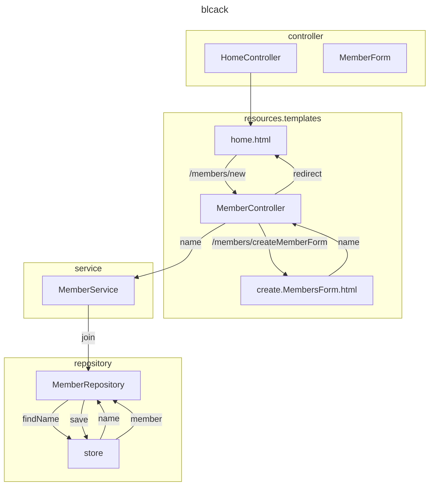

[<back](https://www.notion.so/Spring-2cf44a3f25f542dfbcc88e2390cee6e3?pvs=21)

---

<aside>
📃 목차

</aside>

---



## 비즈니스 요구사항 정리

- 데이터: 회원ID, 이름
- 기능: 회원 등록, 조회
- **아직 데이터 저장소가 선전되지 않음(가상 시나리오)**

**일반적인 웹 애플리케이션 계층 구조**


- 컨트롤러: 웹 MVC의 컨트롤러 역할
- 서비스: 핵심 비즈니스 로직 구현
- 리포지토리: 데이터베이스에 접근, 도메인 객체를 DB에 저장하고 관리
- 도메인: 비즈니스 도메인 객체, 예) 회원, 주문, 쿠폰 등등 주로 데이터베이스에 저장하고 관리됨

**클래스 의존관계**


- 아직 데이터 저장소가 선정되지 않아, **리포지토리는 우선 인터페이스로 구현 클래스를 변경할 수 있도록 설계.**
    - 나중에 데이터 저장소가 선정되면 인터페이스만 갈아 끼우면 됨.
- 데이터 저장소는 RDB, NoSQL 등등 다양한 저장소를 고민중인 상황으로 가정.
- 개발을 진행하기 위해서 초기 개발 단계에서는 구현체로 가벼운 메모리 기반의 데이터 저장소 사용.

---

## 회원 도메인과 리포지토리 만들기

**hello.hello_spring.domain.Member.java**

```java
package hello.hello_spring.domain;

public class Member {

    private Long id;
    private String name;

    public Long getId() {
        return id;
    }

    public void setId(Long id) {
        this.id = id;
    }

    public String getName() {
        return name;
    }

    public void setName(String name) {
        this.name = name;
    }
}
```

**hello.hello_spring.repository.MemberRepository.java(interface)**

```java
package hello.hello_spring.repository;

import hello.hello_spring.domain.Member;

import java.util.List;
import java.util.Optional;

public interface MemberRepository {
    Member save(Member member);
    Optional<Member> findById(Long id);
    Optional<Member> findByName(String name);
    List<Member> findAll();
}
```

**hello.hello_spring.repository.MemoryMemberRepository.java(interface)**

```java
package hello.hello_spring.repository;

import hello.hello_spring.domain.Member;

import java.util.*;

public class MemoryMemberRepository implements MemberRepository{

    private static Map<Long, Member> store = new HashMap<>();
    private static long sequence = 0L;

    @Override
    public Member save(Member member) {
        member.setId(++sequence);
        store.put(member.getId(), member);
        return member;
    }

    @Override
    public Optional<Member> findById(Long id) {
        return Optional.ofNullable(store.get(id));
    }

    @Override
    public Optional<Member> findByName(String name) {
        return store.values().stream()
                .filter(member -> member.getName().equals(name))
                .findAny();
    }

    @Override
    public List<Member> findAll() {
        return new ArrayList<>(store.values());
    }
}
```

## 회원 리포지토리 테스트 케이스 작성

개발한 기능을 실행해서 테스트 할 때 자바의 main 메서드를 통해 실행하거나, 웹 애플리케이션의 컨트롤러를 통해 해당 기능을 실행함. 이러한 방법은 준비하고 실행하는데 오래 걸리고, 반복 실행하기 어렵고 여러 테스트를 한번에 실행하기 어렵다는 단점이 있다. 자바는 JUnit이라는 프레임워크로 테스트를 실행해서 이러한 문제를 해결

**회원 리포지토리 메모리 구현체 테스트**

`hello-spring/src/test/java/hello/hello_spring/repository/MemoryMemberRepositoryTest.java`

**MemoryMemberRepository**

```java
package hello.hello_spring.repository;

import hello.hello_spring.domain.Member;

import java.util.*;

public class MemoryMemberRepository implements MemberRepository {

    private static Map<Long, Member> store = new HashMap<>();
    private static long sequence = 0L;

...

    public void clearStore() {
        store.clear();
    }
}

```

**MemoryMemberRepositoryTest**

```java
package hello.hello_spring.repository;

import hello.hello_spring.domain.Member;
import org.assertj.core.api.Assertions;
import org.junit.jupiter.api.AfterEach;
import org.junit.jupiter.api.Test;

import java.util.List;
import java.util.Optional;

import static org.assertj.core.api.Assertions.*;

class MemoryMemberRepositoryTest {

    MemoryMemberRepository repository = new MemoryMemberRepository();

    @AfterEach
    public void afterEach() {
        repository.clearStore();
    }

    @Test
    public void save() {
        Member member = new Member();
        member.setName("spring");

        repository.save(member);

        Member result = repository.findById(member.getId()).get();

        assertThat(member).isEqualTo((result));
    }

    @Test
    public void findByName() {
        Member member1 = new Member();
        member1.setName("spring1");
        repository.save(member1);

        Member member2 = new Member();
        member2.setName("spring2");
        repository.save(member2);

        Member result = repository.findByName("spring1").get();

        assertThat(result).isEqualTo(member1);
    }

    @Test
    public void findAll() {
        Member member1 = new Member();
        member1.setName("spring1");
        repository.save(member1);

        Member member2 = new Member();
        member2.setName("spring2");
        repository.save(member2);

        List<Member> result = repository.findAll();

        assertThat(result.size()).isEqualTo(2);
    }
}
```

- 관례상 이름은 해당 클래스에 Test를 붙혀 사용한다.
- 테스트 하고자하는 메서드를 정의하고, 메서드가 정의된 클래스 인터페이스를 생성한다.
- @Test 라는 애노테이션을 달고, `assertions.asserThat(실제값).isEaulaTo(기대하는 값)` 로 테스트 진행
- 각자 테스트로 인해 정의된 값들이 서로 영향을 주어서는 안됨.
따라서, 각각 따로 실행되어야하기 때문에 `MemoryMemberRepository`에 `clearStroe` 메서드 만들기.
    - `@AfterEach` 애노테이션을 달고, 매 메서드 실행마다 `store` 를 `clear`해주는 메서드 실행

## 회원 서비스 개발

`main.java.hello.hello_spring.service.MemberService`

**MemberService**

```java
package hello.hello_spring.service;

import hello.hello_spring.domain.Member;
import hello.hello_spring.repository.MemberRepository;
import hello.hello_spring.repository.MemoryMemberRepository;

import java.util.List;
import java.util.Optional;

public class MemberService {

    private final MemberRepository memberRepository;

    public MemberService(MemberRepository memberRepository) {
        this.memberRepository = memberRepository;
    }

    /*
     * 회원가입
     * */

    public Long join(Member member) {
        //같은 이름이 있는 중복 회원 x
        validateDuplicateMember(member);  //중복회원 검증
        memberRepository.save(member);
        return member.getId();
    }

    /*
     * 전체 회원 조회
     * */
    public List<Member> findMembers() {
        return memberRepository.findAll();
    }

    public Optional<Member> findOne(Long memberId) {
        return memberRepository.findById(memberId);
    }

    private void validateDuplicateMember(Member member) {
        memberRepository.findByName(member.getName())
                .ifPresent(m -> {
                    throw new IllegalStateException("이미 존재하는 회원입니다.");
                });
    }
}
```

`test.java.hello.hello_spring.service.MemberServiceTest`

**MemberServiceTest**

```java
package hello.hello_spring.service;

import hello.hello_spring.domain.Member;
import hello.hello_spring.repository.MemoryMemberRepository;
import org.assertj.core.api.Assertions;
import org.junit.jupiter.api.AfterEach;
import org.junit.jupiter.api.BeforeEach;
import org.junit.jupiter.api.Test;

import static org.assertj.core.api.Assertions.*;
import static org.junit.jupiter.api.Assertions.*;

class MemberServiceTest {

    MemberService memberService;
    MemoryMemberRepository memberRepository;

    @BeforeEach
    public void beforeEach() {
        memberRepository = new MemoryMemberRepository();
        memberService = new MemberService(memberRepository);
    }
    @AfterEach
    void afterEach() {
        memberRepository.clearStore();
    }

    @Test
    void 회원가입() {
        //given
        Member member = new Member();
        member.setName("spring");

        //when
        Long saveId = memberService.join(member);

        //then
        Member findMember = memberService.findOne(saveId).get();
        assertThat(member.getName()).isEqualTo(findMember.getName());
    }

    @Test
    public void 중복_회원_예외() {
        //given
        Member member1 = new Member();
        member1.setName("spring");

        Member member2 = new Member();
        member2.setName("spring");

        //when
        memberService.join(member1);
        IllegalStateException e = assertThrows(IllegalStateException.class, () -> memberService.join(member2));
        assertThat(e.getMessage()).isEqualTo("이미 존재하는 회원입니다.");

        /*
        try {
            memberService.join(member2);
            fail();
        } catch (IllegalStateException e) {
            assertThat(e.getMessage()).isEqualTo("이미 존재하는 회원입니다.");
        }
*/
        //then
    }

    @Test
    void findMembers() {
    }

    @Test
    void findOne() {
    }
}
```
