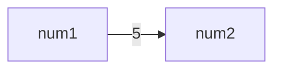
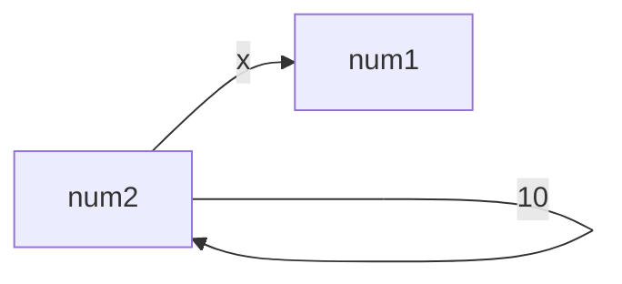

[<back](https://www.notion.so/Section9-fcbd21d68bc44eb38bf727c854c2267b?pvs=21)

---

<aside>
💡 목차

</aside>

---

## 변수명 vs 메서드명

변수 이름은 일반적으로 명사 사용. 한편 메서드는 무언가 동작하는데 사용하기에 일반적으로 동사 사용.

- 변수명 예): `costumerName`, `totalSum`, `employeeCount`, `isvailable`
- 메서드명 예): `printReport()`, `calculateSum()`, `addCustomer()`, `getEmployeeCount()`, `setEmployeeName()`

## 메서드 사용의 장점

- **코드 재사용**: 특정 기능을 캡슐화 하므로, 필요할 때마다 그 기능을 다시 작성할 필요 없이 호출하여 재사용
- **코드의 가독성**: 이름이 부여된 메서드는 코드가 수행하는 작업을 나타내므로 추가적인 문맥 제공
- **모듈성**: 큰 프로그램을 작은, 관리 가능한 부분으로 나눌 수 있다. → 가독성 향상, 디버깅 효율성 향상
- **코드 유지관리**: 특정 부분에 문제 발생시 해당 메서드만 수정하면 된다.
- **재사용성과 확장성**: 다른 프로그램이나 프로젝트에서도 재사용 될 수 있으며, 새로운 기능 추가에 유용
- **추상화**: 사용하는 곳에서 메서드의 구현을 몰라도 사용 가능
- **테스트와 디버깅 용이성**: 독립적으로 테스트하고 디버깅 가능. 문제를 신속히 찾고 수정하는데 도움됨

## 메서드 시작

두 숫자를 입력받아서 더하고 출력하는 단순한 기능 개발.

먼저 `1 + 2`를 수행, 그 다음으로 `10 + 20` 수행

**Method1**

```java
package method;

public class Method1 {
    public static void main(String[] args) {

        // 계산1
        int a = 1;
        int b = 2;
        System.out.println(a + "+" + b + " 연산 수행");
        int sum1 = a + b;
        System.out.println("결과1 출력: " + sum1);

        // 계산2
        int x = 10;
        int y = 20;
        System.out.println(x + "+" + y + " 연산 수행");
        int sum2 = x + y;
        System.out.println("결과2 출력: " + sum2);
    }
}
```

- 같은 연산을 두번 수행

**계산1**

```java
int a = 1;
int b = 2;
System.out.println(a + "+" + b + " 연산 수행");
int sum1 = a + b;
System.out.println("결과1 출력: " + sum1);
```

**계산2**

```java
int x = 10;
int y = 20;
System.out.println(x + "+" + y + " 연산 수행");
int sum2 = x + y;
System.out.println("결과2 출력: " + sum2);
```

계산1, 계산2 둘 다 변수를 두개 선언한고, 어떤 연산을 수행하는지 출력한 후 두 변수의 합을 구한다.

간략화 할 수 있는 방법은?

**함수(function)**

`add(a, b)` 함수: 두 값의 합

**함수 정의**

`add(a, b) = a + b`

- 이름이 `add` 이고, `a`, `b` 라는 두 값을 받는 함수이다. 그리고 이 함수는 `a + b` 연산을 수행

**함수 사용**

```java
add(1,2) -> 결과: 3
add(5,6) -> 결과: 11
add(1,2) -> 결과: 8
```

- 함수에 값을 입력하면, 함수가 가진 연산을 처리한 다음 결과를 출력
- 여러번 같은 계산을 해야 한다면 지금처럼 함수를 만들어두고(정의), 필요한 입력 값을 넣어서 해당 함수를 호출
- **핵심: 함수를 정의해두면 여러번 재사용할 수 있다**

**평균 함수**

`avg(a, b)` 함수: 두 값의 평균

**함수 정의**

`avg(a, b) = (a + b) / 2`

**함수 사용**

```java
avg(4,6) -> 결과: 5
avg(10,20) -> 결과: 15
avg(100,200) -> 결과: 150
```

수학의 함수의 개념을 프로그래밍에 가지고와서 반복되는 문제 해결.

## 메서드 사용

자바에서는 함수를 메서드(Method)라 한다.

메서드도 함수의 한 종류라고 생각하면 된다.

**Method1Ref**

```java
package method;

public class Method1Ref {

    public static void main(String[] agrs) {
        // 계산1
        int sum1 = add(5, 10);
        System.out.println("결과1 출력: " + sum1);

        int sum2 = add(15, 20);
        System.out.println("결과2 출력: " + sum2);
    }
    public static int add(int a, int b) {
        System.out.println(a + "+" + b + "연산 수행");
        int sum = a + b;
        return sum;
    }
}
```

**실행결과**

```java
5+10연산 수행
결과1 출력: 15
15+20연산 수행
결과2 출력: 35
```

중복이 제거되고, 코드가 깔끔해졌다

**메서드 정의**

```java
public static int add(int a, int b) {
    System.out.println(a + "+" + b + " 연산수행");
    int sum = a + b;
    return sum;
}
```

이 부분이 바로 메서드이며 메서드를 정의한다고 표현.

어떤 연산을 처리한 다음 결과를 반환

메서드는 크게 **메서드 선언**과 **메서드 본문**으로 나눌 수 있다.

**메서드 선언(Method Declaration)**

`public static int add(int a, int b)`

메서드의 선언 부분으로, 메서드 이름, 반환 타입, 파라미터(매개변수) 목록을 포함한다.

이름 그대로 이런 메서드가 있다고 선언하는 것. 메서드 선언 정보를 통해 다른 곳에서 해당 메서드를 호출 할 수 있다.

- `public static`
    - `public` : 다른 클래에서 호출할 수 있는 메서드라는 뜻. 접근 제어에서 학습
    - `static` : 객체를 생성하지 않고 호출할 수 있는 정적 메서드.
- `int add(int a, int b)`
    - `int` : 반환 타입을 정의. 메서드의 실행 결과를 반환할 때 사용할 타입을 지정
    - `add` : 메서드에 이름을 부여. 이 이름으로 메서드를 호출
    - `(int a, int b)` : 메서드를 호출할 때 전달하는 입력 값 정의. 이 변수들은 해당 메서드 안에서만 사용되며, 이런 변수를 파라미터(parameter), 매개변수라 한다.

**메서드 본분(Method Body)**

```java
{
    System.out.println(a + "+" + b + " 연산 수행");
    int sum = a + b;
    return sum;
}
```

- 메서드가 수행해야하는 코드 블록
- 메서드를 호출하면 메서드 본문이 순서대로 실행
- 메서드 본문은 블랙박스. **메서드를 호출하는 곳에서는 메서드 선언은 알지만 메서드 본문은 모른다.**
- 메서드의 실행 결과를 반환하려면 return문을 사용.
    - `return sum`: `sum` 변수에 들어있는 값을 반환

**메서드 호출**

앞서 정의한 메서드를 호출해서 실행하려면 메서드 이름에 입력 값을 전달하면 된다. 보통 메서드를 호출한다고 표현

```java
int sum1 = add(5, 10);
int sum2 = add(15, 20);
```

**메서드 작동 방식**

```java
//1: 메서드 호출
int sum1 = add(5, 10);

//2. 파라미터 변수 a=5, b=10이 전달되면서 메서드가 수행
public static int add(int a=5, int b=10) {
    int sum = a + b;
    return sum;
}

//3. 메서드가 수행
public static int add(int a=5, int b=10) {
    int sum = a(5) + b(10);
    return sum;
}

//4. return을 사용해서 메서드 실행의 결과인 sum을 반환
public static int add(int a=5, int b=10) {
    int sum = 15;
    return sum(15);
}

//5. 메서드 호출 결과로 메서드에서 반환 값 15가 나온다. 이 값을 sum1에 대입
int sum1 = 15;
```

메서드 호출이 끝나면 더 이상 해당 메서드가 사용한 메모리를 낭비할 이유가 없으므로 메서드 정의에 사용한 파라미터 변수인 `int a`, `int b` 그리고 `int sum` 또한 모두 제거된다.

### 메서드 호출과 용어 정리

메서드를 호출할 때는 다음과 같이 메서드에 넘기는 값과 매개변수(파라미터)의 타입이 맞아야한다. 물론 넘기는 값과 매개변수(파라미터)의 순서와 갯수도 맞아야 한다.

```java
호출: call("hello", 20)
메서드 정의: int call(String str, int age)
```

**인수(Argument)**

여기서 “hello”, 20처럼 넘기는 값을 영어로 Argument(아규먼트), 한글로 인수 또는 인자라 한다.

실무에서는 아규먼트, 인수, 인자라는 용어 모두 사용

- 사용자가 쓰는 것(호출하는 것)

**매개변수(Parameter)**

메서드를 정의할 때 선언한 변수인 String str, int age를 매개변수, 파라미터라 한다.

메서드르 호출할 때 인수를 넘기면, 그 인수가 매개변수에 대입된다.

실무에서는 매개변수, 파라미터 용어를 모두 사용한다.

- 만드는 사람이 쓰는 것(정의하는 것)

**용어정리**

- 인수라는 용어는 ‘인’과 ‘수’의 합서어로, ‘들어가는 수’라는 의미를 가진다. 즉, 메서드 내부로 들어가는 값을 의미. 인자도 같은 의미
- 매개변수, parameter는  ‘매개’와 ‘변수’의 합성어로, ‘중간에서 전달하는 변수’라는 의미를 갖는다. 즉, 메서드 호출부에와 메서드 내부 사이에서 값을 전달하는 역할

## 메서드 정의

메서드는 다음과 같이 정의한다.

```java
public static int add(int a, int b) {
    //메서드 본문, 실행 코드
}
제어자 반환타입 메서드이름(매개변수 목록) {
    메서드 본문
}
```

- **제어자(Modifier)**: `public`, `static`과 같은 부분이다. 나중에 자세히 다룰 예정
- **반환 타입(Return Type)**: 메서드가 실행 된 후 반환하는 데이터 타입을 지정. 메서드가 값을 반환하지 않는 경우 없다는 뜻의 `void`를 사용. 예) void print(String str)
- **메서드 이름(Method Name):** 메서드를 호출할 때 사용하는 메서드 이름
- **매개변수(Parameter):** 입력 값으로, 메서드 내부에서 사용할 수 있는 변수. 매개변수는 옵션이며, 입력값이 필요없는 메서드에서는 매개변수를 지정하지 않아도 된다. 예) add()
- **메서드 본문(Method body):** 실제 메서드의 코드가 위치. 중괄호 `{}` 사이에 코드를 작성

### 매개변수가 없거나 반환 타입이 없는 경우

**Method2**

```java
package method;

public class Method2 {

    public static void main(String[] args) {
        printHeader();
        System.out.println("프로그램이 동작합니다.");
        printFooter();
    }

    public static void printHeader() {
        System.out.println("= 프로그램을 시작합니다 =");
        return;  //void의 경우 생략가능
    }

    public static void printFooter() {
        System.out.println("= 프로그램을 종료합니다 =");
    }
}
```

**실행결과**

```java
= 프로그램을 시작합니다 =
프로그램이 동작합니다.
= 프로그램을 종료합니다 =
```

`printHeader()`, `printFooter()` 메서드는 매개변수가 없고, 반환타입도 없다.

- 매개변수가 없는 경우
    - 선언: `public static void printHeader()` 와 같이 매개변수를 비워두고 정의
    - 호출: `printHeader();` 와 같이 인수를 비워두고 호출
- 반환 타입이 없는 경우
    - 선언: `public static void printHeader()` 와 같이 반환티입을 `void`로 정의
    - 호출: `printHeader();` 와 같이 반환 타입이 없으므로 메서드만 호출하고 반환값을 받지 않음.
        - `String str = printHeader();` 반환 타입이 `void`이기 때문에 이렇게 반환값을 받으면 컴파일 오류가 발생
            
            에러발생
            
            ```java
            java: incompatible types: void cannot be converted to java.lang.String
            ```
            

void와 return 생략

모든 메서드는 항상 `return`을 호출해야한다. 그런데 반환 타입이 `void`의 경우에는 예외로 `printFooter()`와 같이 생략해도 된다. 자바 컴파일러가 반환 타입이 없는 경우에는 `return`을 마지막에 넣어줌. 참고로 `return`을 만나면 해당 메서드는 종료됨.

## 반환 타입

### 반환 타입이 있으면 반드시 값을 반환해야 한다.

반환타입이 있으면 반드시 `return`을 사용해서 값을 반환해야한다.

**MethodReturn1**

```java
package method;

public class MethodRetrun1 {
    public static void main(String[] agrs) {
        boolean result = odd(2);
        System.out.println(result);
    }

    public static boolean odd(int i) {
        if (i % 2 == 1) {
            return true;
        }
    }
}
```

**실행결과 - 컴파일 오류**

```java
java: missing return statement
```

이 코드에서 if 조건이 만족할 때는 true가 반환되지만, 조건을 만족하지 않는 경우 `return` 문이 실행되지 않는다. 따라서, `return` 문을 누락했다는 컴파일 오류가 발생.

**MethodReturn1 - 수정코드**

```java
package method;

public class MethodRetrun1 {
    public static void main(String[] agrs) {
        boolean result = odd(2);
        System.out.println(result);
    }

    public static boolean odd(int i) {
        if (i % 2 == 1) {
            return true;
        } else {
            return false;
        }
    }
}
```

**실행결과**

```java
false
```

### return 문을 만나면 그 즉시 메서드를 빠져나간다.

다음 로직을 수행하는 메서드르 만들어보자.

- 18살 미만의 경우: 미성년자는 출입이 불가합니다.
- 18살 이상의 경우: 입장하세요

**MethodRetrun2**

```java
package method;

public class MethodReturn2 {
    public static void main(String[] args) {
        checkAge(10);
        checkAge(20);
    }

    public static void checkAge(int age) {
        if (age >= 18) {
            System.out.println(age + "살, 입장하세요.");
            return;
        } else {
            System.out.println(age + "살, 미성년자는 출입이 불가합니다.");
        }
    }
}
```

**실행결과**

```java
10살, 미성년자는 출입이 불가합니다.
20살, 입장하세요.
```

반환 값 무시

반환 타입이 있는 메서드를 호출했는데 만약 반환 값이 필요없다면 사용하지 않아도 됨.

예시1: `int sum = add(1, 2)`  //반환된 값을 받아서 sum에 저장

예시2: `add(1, 2)`  //반환된 값을 사용하지 않고 버림. 단순히 메서드만 호출

## 메서드 호출과 값 전달1

<aside>
💡 자바에서 정말 중요한 대원칙!!!

**자바는 항상 변수의 값을 복사해서 대입한다.**

</aside>

이 대원칙을 이해하면 복잡한 상황에서도 코드를 단순하게 이해할 수 있다.

### 변수와 값 복사

다음 코드를 보고 어떤 결과가 나올지 먼저 생각해보자.

**MethodValue0**

```java
package method;

public class MethodValue0 {

    public static void main(String[] args) {
        int num1 = 5;
        int num2 = num1;
        num2 = 10;
        System.out.println("num1= " + num1);
        System.out.println("num2= " + num2);
    }
}
```

**실행 결과**

```java
num1= 5
num2= 10
```

**실행 과정**

```java
int num2 = num1;  //num1의 값은 5 num1(5)
int num2 = 5;  //num2 변수에 대입하기 전에 num1의 값 5를 읽는다. 결과: num1(5), num2(5)
num2 = 10;  //num2에 10을 대입한다. 결과: num1(5), num2(10)
```

여기서 값을 복사해서 대입한다는 부분이

```java
int num2 = num1;
```

- 이 부분을 생각해보면 `num1`에 있는 값 `5`를 복사해서 `num2`에 넣는 것이다.
    - `num1`의 원본데이터를 `num2`에 넣는다면 `num2`를 수정할 시 `num1`도 함께 수정될 것이다.
    - `num1`이라는 변수 자체가 `num2`에 들어가는 것이 아니라 `num1`에 있는 값을 읽고 복사해서 `num2`에 넣는 것이다.

### 메서드 호출과 값 복사

**MethodValue1**

```java
package method;

public class MethodValue1 {
    public static void main(String[] args) {
        int num1 = 5;
        System.out.println("1. changeNumber 호출 전, num1: " + num1);
        changeNumber(num1);
        System.out.println("4. changeNumber 호출 후, num1: " + num1);
    }

    public static void changeNumber(int num2) {
        System.out.println("2. changNumber 변경 전, num2: " + num2);
        num2 = num2 * 2;
        System.out.println("3. changeNumber 변경 후, num2: " + num2);
    }
}
```

실행결과가 10라고 생각한다면, 이 때 위 개념이 필요하다.

**실행결과**

```java
1. changeNumber 호출 전, num1: 5
2. changNumber 변경 전, num2: 5
3. changeNumber 변경 후, num2: 10
4. changeNumber 호출 후, num1: 5
```

자바는 항상 변수의 값을 복사해서 대입한다.

**changeNumber(num1) 호출 시점**

- `num1`의 값 `5`를 읽고 복사해서 `num2`에 전달 → 이 부분이 핵심



**changeNumber메서드 실행중**

- `num2`의 변경은 `num1`에 영향을 주지 않는다. 왜냐하면 앞서 값을 복사해서 전달했기 때문.



**최종 결과**

```java
changeNumber(num1);  //changeNumber를 호출한다. num1(5)
changeNumber(5);  //num1의 값을 읽는다.

void changeNumber (int num2)  //num1의 값 5가 num2에 복사된다. 결과: num1(5), num2(5)
num2 = num2 * 2;  //num2에 2를 곱한다. 결과: num1(5), num2(5)
num2 = 5 * 2;  //num2의 값을 읽어서 2르 ㄹ곱한다. 결과: num1(5), num2(10)
num2 = 10;  //num2에 계산 결과인 값 10을 대입한다. 결과: num1(5), num2(10)

num2를 출력한다: num2의 값인 10이 출력.
num1을 출력한다: num1의 값인 5가 출력.
```

결과적으로 매개변수 `num2`의 값만 10으로 변경되고 `num1`의 값은 변경되지 않고 기존 값인 5로 유지된다.

자바는 항상 값을 복사해서 전달하기 때문에 `num2`의 값을 바꾸더라도 `num1`에는 영향을 주지 않는다.

## 메서드 호출과 값 전달2

### 메서드 호출과 이름이 같은 변수

같은 문제를 호출자의 변수 이름과 매개변수와 이름을 같게해서 한번 더 풀어보자

**MethodValue2**

```java
package method;

public class MethodValue2 {
    public static void main(String[] args) {
        int number = 5;
        System.out.println("1. changeNumber 호출 전, number: " + number);  //출력: 5
        changeNumber(number);
        System.out.println("4. changeNumber 호출 후, number: " + number);  //출력 : 5
    }

    public static void changeNumber(int number) {
        System.out.println("2. changeNumber 변경 전, number: " + number);  //출력: 5
        number = number * 2;
        System.out.println("3. changeNumber 변경 후, number: " + number);  //출력: 10
    }
}
```

이번에는 `main()` 에 정의한 변수와 메서드의 매개변수(파라미터)의 이름이 둘다 number로 같다.

**실행결과**

```java
1. changeNumber 호출 전, number: 5
2. changeNumber 변경 전, number: 5
3. changeNumber 변경 후, number: 10
4. changeNumber 호출 후, number: 5
```

`main()` 도 사실 메서드이다. 각각의 메서드 안에서 사용하는 변수는 서로 완전히 분리된 다른 변수이다. 물론 이름이 같아도 완전히 다른 변수다. 따라서 `main()`의 `number`와 `changeNumber()`의 `number`는 서로 다른 변수

**실행 과정**

```java
changeNumber(number);  //changeNumber를 호출한다. main의 number(5)
changeNumber(5);  //number의 값을 읽는다.

//main의 number값 5가 changNumber의 number에 복사된다.
//결과: main의 number(5), changeNumber의 number(5)
void changeNumber(int number = 5)

//changeNumber의 number에 값 10을 대입한다.
//결과: main의 number(5), changeNumber의 number(10)
number = number * 2
main의 number을 출력한다: main의 number의 값인 5가 출력된다.
```

**MethodValue3**

```java
package method;

public class MethodValue3 {
    public static void main(String[] args) {
        int num1 = 5;
        System.out.println("1. changeNumber 호출 전, num1: " + num1);  //출력: 5
        num1 = changeNumber(num1);
        System.out.println("4. changeNumber 호출 후, num1: " + num1);  //출력 : 5
    }

    public static int changeNumber(int num2) {
        System.out.println("2. changeNumber 변경 전, num2: " + num2);  //출력: 5
        num2 = num2 * 2;
        System.out.println("3. changeNumber 변경 후, num2: " + num2);  //출력: 10
        return num2;
    }
}
```

**실행결과**

```java
1. changeNumber 호출 전, num1: 5
2. changeNumber 변경 전, num2: 5
3. changeNumber 변경 후, num2: 10
4. changeNumber 호출 후, num1: 10
```

**실행과정**

```java
num1 = changeNumber(num1);  //num1(5)
num1 = changeNumber(5);

//호출 시작:changeNumber()
//num1의 값 5가 num2에 대입된다. num1의 값을 num2에 복사한다. num1(5), num2(5)
int changeNumber(int num2 = 5)
num2 = num2 * 2;  //계산 결과: num1(5), num2(10)
return num2;  //num2의 값은 10이다.
//호출 끝: changeNumber()

num1 = changeNumber(5);  //반환 결과가 10이다.
num1 = 10;  //결과: num1(10)
```

**정리**

**자바는 항상 변수의 값을 복사해서 대입한다.**

**참조형의 경우, 참조형 변수에 있는 값인 참조값을 복사**

## 메서드와 형변환

메서들르 호출할 때도 형변환이 적용된다. 메서드 호출과 명시적 형변환, 자동 형변환에 대해 알아보자.

### 명시적 형변환

메서드를 호출하는데 인자와 매개변수의 타입이 맞지 않는다면?

**MethodCasting1**

```java
package method;

public class MethodCasting1 {
    public static void main(String[] args) {
        double number = 1.5;
        //printNumber(number);  //double을 int에 대입하므로 컴파일 오류
        printNumber((int) number);  // 명시적 형변환을 사용해 double을 int로 변환
    }

    public static void printNumber(int n) {
        System.out.println("숫자: " + n);
    }
}
```

- 위 주석(`//`)경우 double을 int에 담을 수 없으므로 오류가 발생한다.

**실행결과**

```java
java: incompatible types: possible lossy conversion from double to int
```

다음과 같은 이유로 컴파일 오류가 발생한다.

```java
printNumber(number)  //number는 1.5실수
printNumber(1.5)  //메서드를 호출하기 전 number 변수의 값 읽음
void printNumber(int n = 1.5)  //int형 매개변수 n에 double형 실수인 1.5를 대입 시도, 컴파일 오류
```

이 경우 메서드 호출이 꼭 필요하다면 다음과 같이 명시적 형변환을 사용

```java
printNumber((int) number);  // 명시적 형변환을 사용해 double을 int로 변환
printNumber(1);  // (double) 1.5 -> (int) 1로 변환
void printNumber(int n = 1)  //int형 파라미터 변수 n에 int형 1을 대입
```

**실행결과**

```java
숫자: 1
```

### 자동 형변환

`int < long < double`

메서드를 호출할 때 매개변수에 값을 전달하는 것도 결국 변수에 값을 대입하는 것이다. 따라서 앞서 배운 자동 형변환이 그대로 적용됨.

**MethodCasting2**

```java
package method;

public class MethodCasting2 {
    public static void main(String[] args) {
        int number = 100;
        printNumber(number);
    }

    public static void printNumber(double n) {
        System.out.println("숫자: " + n);
    }
}
```

- `double`형 매개변수(파라미터)에 `int`형 인수를 전달하는 것은 문제 없다

**실행결과**

```java
숫자: 100.0
```

다음과 같이 자동 형변환이 동작한다.

```java
printNumber(number);  // number는 int형 100
printNUmber(100);  //메서드를 호출하기 전에 number 변수의 값을 읽음

void printNumber(double n=100)  //double형 파라미터 변수 n에 int형 100을 대입
void printNumber(double n=(double) 100)  //double이 더 큰 숫자 범위이므로 자동 형변환 적용
void printNumber(double n=100.0)  //자동 형변환 완료
```

**정리**

메서드를 호출할 때는 전달하는 인수의 타입과 매개변수의 타입이 맞아야한다. 단, 타입이 달라도 자동 형변환이 가능한 경우에는 호출 할 수 있다.

## 메서드 오버로딩

다음과 같은 메서드를 만들고 싶다.

- 두 수를 더하는 메서드
- 세 수를 더하는 메서드

이 경우 둘다 더하는 메서드이기 때문에 가급적 같은 이름인 `add` 를 사용하고 싶다.

자바는 메서드의 이름 뿐만 아니라 매개변수 정보를 함께 사용해서 메서드를 구분한다.

따라서 다음과 같이 이름이 같고, 매개변수가 다른 메서드를 정의 할 수 있다.

**오버로딩 성공**

```java
add(int a, int b)
add(int a, int b, int c)
add(double a, double b)
```

이렇게 이름이 같고 매개변수가 다른 메서드를 여러개 정의하는 것을 메서드 오버로딩(Overloading)이라 한다.

오버로딩은 번역하면 과적인데, 과하게 물건을 담았다는 뜻이다. 따라서 같은 이름을 여러개 정의했다고 이해하면 된다.

**오버로딩 규칙**

메서드의 이름이 같아도 매개변수의 타입 및 순서가 다르면 오버로딩을 할 수 있다. **참고로 반환 타입은 인정하지 않는다.**
다음 케이스는 메서드 이름과 매개변수 타입이 같으므로 컴파일 오류가 발생한다. 반환 타입은 인정하지 않는다.

**오버로딩 실패**

```java
int add(int a, int b)
double add(int a, int b)
```

```java
int add(int a, int b)
int add(int c, int d)
```

→ 자바 입장에서는 int형 반환타입 메서드를 불러와야하는지, double형 반환타입의 메서드를 불러와야하는지 판단할 수 없으므로 컴파일 오류를 발생시킨다.

**용어: 메서드 시그니처(method signature)**

`메서드 시그니처 = 메서드 이름 + 매개변수 타입(순서)`

자바에서는 메서드를 구분할 수 있는 고유한 식별자나 서명을 뜻하며, 시그니처는 메서드 이름, 매개변수 타입(순서 포함)으로 구성되어 있다. 자바 입장에서는 각각의 메서드를 고유하게 구분할 수 있어야 어떤 메서드를 불러올지 결정할 수 있다.

메서드 오버로딩에서 설명한 것 처럼 메서드 이름이 같아도 메서드 시그니처가 다르면 다른 메서드로 간주.

반환 타입은 시그니처에 포함되지 않는다. 방금 오버로딩이 실패한 두 메서드는 `add(int a, int b)` 로 메서드 시그니처가 같다. 따라서 메서드의 구분이 불가능하므로 컴파일 오류가 발생한다.

**Overloading1**

```java
package method;

public class Overloading1 {
    public static void main(String[] args) {
        System.out.println("1: " + add(1, 2));
        System.out.println("2: " + add(1, 2, 3));
    }

    public static int add(int a, int b) {
        System.out.println("1번 호출");
        return a + b;
    }

    public static int add(int a, int b, int c) {
        System.out.println("2번 호출");
        return a + b + c;
    }
}
```

**실행결과**

```java
1번 호출
1: 3
2번 호출
2: 6
```

매개변수 타입이 다른 오버로딩-1

**Overloading2**

```java
package method;

public class Overloading2 {
    public static void main(String[] args) {
        myMethod(1, 1.5);
        myMethod(1.5, 1);
    }

    public static void myMethod(int a, double b) {
        System.out.println("int a, double b");
    }

    public static void myMethod(double a, int b) {
        System.out.println("double a, int b");
    }
}
```

1: 정수 1, 실수 1.5로 호출했으므로, `myMethod(int a, double b)`가 호출.

2: 실수 1.5, 정수 1로 호출했으므로, `myMethod(double a, int b)`가 호출.

**실행결과**

```java
int a, double b
double a, int b
```

매개변수 타입이 다른 오버로딩-2

**Overloading3**

```java
package method;

public class Overloading3 {
    public static void main(String[] args) {
        System.out.println("1: " + add(1, 2));
        System.out.println("2: " + add(1.2, 1.5));
    }

    public static int add(int a, int b) {
        System.out.println("1번 호출");
        return a + b;
    }

    public static double add(double a, double b) {
        System.out.println("2번 호출");
        return a + b;
    }
}
```

**실행결과**

```java
1번 호출
1: 3
2번 호출
2: 2.7
```

여기서 만약 다음 첫 번째 메서드를 삭제하면?

**Overloading3_1**

```java
package method;

public class Overloading3_1 {
    public static void main(String[] args) {
        System.out.println("1: " + add(1, 2));
        System.out.println("2: " + add(1.2, 1.5));
    }

    public static double add(double a, double b) {
        System.out.println("2번 호출");
        return a + b;
    }
}
```

1: `int`형 정수 1, `int`형 정수 2를 호출, 자동 형변환이 발생해서 `add(double a, double b)`가 호출

2: 실수 1.2, 실수 1.5를 호출했으므로 `add(double a, double b)`가 호출

**실행결과**

```java
2번 호출
1: 3.0
2번 호출
2: 2.7
```

정리하면 먼저 본인의 타입에 최대한 맞는 메서드를 찾아서 실행하고, 그래도 없으면 형 변환 가능한 타입의 메서드를 찾아서 실행한다.

## 문제와 풀이 1

다음 코드 리펙토링해보자

### 문제 - 평균값 리펙토링

**MethodEx1**

```java
package method.ex;

public class MethodEx1 {
    public static void main(String[] args) {
        int a = 1;
        int b = 2;
        int c = 3;

        int sum = a + b + c;
        double average = sum / 3.0;
        System.out.println("평균값: " + average);

        int x = 15;
        int y = 25;
        int z = 35;

        sum = x + y + z;
        average = sum / 3.0;
        System.out.println("평균값: " + average);
    }
}
```

**MethodEx1Ref_1(내가 작성한 코드)**

```java
package method.ex;

public class MethodEx1Ref {
    public static void main(String[] args) {
        int sum1 = sum(1, 2, 3);
        System.out.println(average(sum1));

        int sum2 = sum(15, 25, 35);
        System.out.println(average(sum2));
    }

    public static int sum(int a, int b, int c) {
        return a + b + c;
    }

    public static double average(double sum) {
        double average = sum / 3;
        System.out.print("평균값: ");
        return average;
    }
}
```

**실행결과**

```java
평균값: 2.0
평균값: 25.0
```

**MethodEx1_2(김영한 제안코드)**

```java
package method.ex;

public class MethodEx1_2Ref {
    public static void main(String[] args) {
        System.out.println("평균값: " + average(1,2,3));
        System.out.println("평균값: " + average(15, 25, 35));
    }

    public static double average(int a, int b, int c) {
        int sum = a + b + c;
        return sum / 3.0;
    }
}
```

**실행결과**

```java
평균값: 2.0
평균값: 25.0
```

### 문제 - 반복 출력 리펙토링

**MethodEx2**

```java
package method.ex;

public class MethodEx2 {
    public static void main(String[] args) {
        String message = "Hello, world!";

        for (int i = 0; i < 3; i++) {
            System.out.println(message);
        }

        for (int i = 0; i < 5; i++) {
            System.out.println(message);
        }

        for (int i = 0; i < 7; i++) {
            System.out.println(message);
        }
    }
}
```

**MethodEx2_1Ref(내가 작성한 코드)**

```java
package method.ex;

public class MethodEx2_1Ref {
    public static void main(String[] args) {
        repeatString(3, "hello world");
        repeatString(5, "hello world");
        repeatString(7, "hello world");
    }

    public static void repeatString(int a, String string) {
        for (int i = 0; i < a; i++) {
            System.out.println(string);
        }
        return;
    }
}
```

**실행결과**

```java
hello world
hello world
hello world
hello world
hello world
hello world
hello world
hello world
hello world
hello world
hello world
hello world
hello world
hello world
hello world
```

**MethodEx2_2Ref(김영한 제안 코드)**

```java
package method.ex;

public class MethodEx2_2Ref {
    public static void main(String[] args) {
        repeatString(3, "hello world");
        repeatString(5, "java");
        repeatString(7, "spring");
    }

    public static void repeatString(int times, String message) {
        for (int i = 0; i < times; i++) {
            System.out.println(message);
        }
    }
}
```

**실행결과**

```java
hello world
hello world
hello world
java
java
java
java
java
spring
spring
spring
spring
spring
spring
spring
```

### 문제 - 입출금 리펙토링

입급(deposit)과, 출금(withdraw)을 메서드로 만들어서 리펙토링

**MethodEx3**

```java
package method.ex;

public class MethodEx3 {
    public static void main(String[] args) {
        int balance = 10000;

        // 입금 500
        int depositAmount = 1000;
        balance += depositAmount;
        System.out.println(depositAmount + "원을 입금하였습니다. 현재 잔액: " + balance + "원");

        // 출금 200
        int withdrawAmount = 2000;
        if (balance >= withdrawAmount) {
            balance -= withdrawAmount;
            System.out.println(withdrawAmount + "원을 출금하였습니다. 현재 잔액: " + balance + "원");
        } else {
            System.out.println(withdrawAmount + "원을 출금하려 했으나 잔액이 부족합니다.");
        }

        System.out.println("최종 잔액: " + balance + "원");
    }
}
```

**실행결과**

```java
1000원을 입금하였습니다. 현재 잔액: 11000원
2000원을 출금하였습니다. 현재 잔액: 9000원
최종 잔액: 9000원
```

**MethodEx3_1Ref**

```java
package method.ex;

public class MethodEx3_1Ref {
    public static void main(String[] args) {
        int balance = 10000;
        int depositAmount = 1000;
        int withdrawAmount = 2000;

        deposit(depositAmount, balance);
        balance = balance + depositAmount;

        withdraw(withdrawAmount, balance);
        balance = balance - withdrawAmount;

        System.out.println("최종 잔액: " + balance + "원");
    }

    public static void deposit (int depositAmount, int balance) {
        System.out.println(depositAmount + "원을 입금하였습니다. 현재잔액: " + (balance + depositAmount) + "원");
    }

    public static void withdraw(int withdrawAmount, int balance) {
        if (balance - withdrawAmount < 0) {
            System.out.println(withdrawAmount + "원을 출금하려 했으나 잔액이 부족합니다.");
        } else {
            System.out.println(withdrawAmount + "원을 출금하였습니다. 현재잔액: " + (balance - withdrawAmount) + "원");
        }
    }
}

```

**MethodEx3_2Ref**

```java
package method.ex;

public class MethodEx3_2Ref {
    public static void main(String[] args) {
        int balance = 10000;

        balance = deposit(balance, 1000);
        balance = withdraw(balance, 2000);
        
        System.out.println("최종 잔액: " + balance + "원");
    }

    public static int deposit (int balance, int amount) {
        balance += amount;
        System.out.println(amount + "원을 입금하였습니다. 현재잔액: " + balance + "원");
        return balance;
    }

    public static int withdraw(int balance, int amount) {
        if (balance >= 0) {
            balance -= amount;
            System.out.println(amount + "원을 출금하였습니다. 현재잔액: " + balance + "원");
        } else {
            System.out.println(amount + "원을 출금하려 했으나 잔액이 부족합니다.");
        }
        return balance;
    }
}
```

- 리펙토링 결과를 보면 `main()` 은 세세한 코드가 아니라 전체 구조를 한눈에 볼 수 있게 되어있음.
- 쉽게 얘기해 책의 목차를 보는 것 같으며, 더 자세히 알고싶으면 해당 메서드를 찾아 가면 된다.
- 메서드는 기능에 따라 명확히 구분되기 때문에 유지보수 하기에도 편하다.
- 이런 리펙토링을 메서드 추출(Extract Method)라 한다.

## 문제와 풀이2

### 문제 - 은행 계좌 입출금

- 사용자로부터 계속 입력을 받아 입금과 출금을 반복 수행하는 프로그램 작성
- 출금시 잔액이 부족하다면 “x원을 출금하려 했으나 잔액이 부족합니다.”라고 출력

**실행 예시**

```java
-------------------------------------
1. 입금 | 2. 출금 | 3. 잔액 확인 | 4. 종료
-------------------------------------
선택: 1
입금액을 입력하세요: 10000
10000원을 입금하였습니다. 현재 잔액: 10000
-------------------------------------
1. 입금 | 2. 출금 | 3. 잔액 확인 | 4. 종료
-------------------------------------
선택: 2
출금액을 입력하세요.: 8000
8000원을 출금하였습니다. 현재 잔액: 2000
-------------------------------------
1. 입금 | 2. 출금 | 3. 잔액 확인 | 4. 종료
-------------------------------------
선택: 3
현재 잔액: 2000
-------------------------------------
1. 입금 | 2. 출금 | 3. 잔액 확인 | 4. 종료
-------------------------------------
선택: 5
올바른 명령을 입력하세요.
-------------------------------------
1. 입금 | 2. 출금 | 3. 잔액 확인 | 4. 종료
-------------------------------------
선택: 4
시스템을 종료합니다.
```

**MethodEx4_1 (내가 작성한 코드)**

```java
package method.ex;

import java.util.Scanner;

public class MethodEx4_1 {
    public static void main(String[] args) {
        Scanner scanner = new Scanner(System.in);
        int balance = 0;
        while (true) {
            System.out.println("-------------------------------------");
            System.out.println("1. 입금 | 2. 출금 | 3. 잔액 확인 | 4. 종료");
            System.out.println("-------------------------------------");
            System.out.print("선택: ");
            
            int menu = scanner.nextInt();
            if (menu == 1) {
                System.out.print("입금액을 입력하세요: ");
                int amount = scanner.nextInt();
                balance = deposit(amount, balance);
                System.out.println(amount + "원을 입금하였습니다. 현재 잔액: " + balance);
            
            } else if (menu == 2) {
                System.out.print("출금액을 입력하세요.: ");
                int amount = scanner.nextInt();
                if (balance - amount >= 0) {
                    balance = withdraw(amount, balance);
                    System.out.println(amount + "원을 출금하였습니다. 현재 잔액: " + balance);
                } else {
                    System.out.println(amount + "원을 출금하려 했으나 잔액이 부족합니다. 현재 잔액: " + balance);
                }
            
            } else if (menu == 3) {
                System.out.println("현재 잔액: " + balance);
            
            } else if (menu == 4) {
                System.out.println("시스템을 종료합니다.");
                break;
            
            } else {
                System.out.println("올바른 명령을 입력하세요.");
            }
        }
    }

    public static int deposit(int amount, int balance) {
        return amount + balance;
    }

    public static int withdraw(int amount, int balance) {
        return balance - amount;
    }
}
```

**MethodEx4_2 (김영한 제안 코드)**

```java
package method.ex;

import java.util.Scanner;

public class MethodEx4_2 {
    public static void main(String[] args) {
        Scanner scanner = new Scanner(System.in);
        int balance = 0;

        while (true) {
            System.out.println("-------------------------------------");
            System.out.println("1. 입금 | 2. 출금 | 3. 잔액 확인 | 4. 종료");
            System.out.println("-------------------------------------");
            System.out.print("선택: ");
            int amount;

            int menu = scanner.nextInt();
            switch (menu) {
                case 1 -> {
                    System.out.print("입금액을 입력하세요: ");
                    amount = scanner.nextInt();
                    balance = deposit(amount, balance);
                    System.out.println(amount + "원을 입금하였습니다. 현재 잔액: " + balance);
                    break;
                }
                case 2 -> {
                    System.out.print("출금액을 입력하세요.: ");
                    amount = scanner.nextInt();
                    if (balance - amount >= 0) {
                        balance = withdraw(amount, balance);
                        System.out.println(amount + "원을 출금하였습니다. 현재 잔액: " + balance);
                        break;
                    } else {
                        System.out.println(amount + "원을 출금하려 했으나 잔액이 부족합니다. 현재 잔액: " + balance);
                        break;
                    }
                }
                case 3 -> {
                    System.out.println("현재 잔액: " + balance);
                    break;
                }
                case 4 -> {
                    System.out.println("시스템을 종료합니다.");
                    return;
                }
                default -> {
                    System.out.println("올바른 명령을 입력하세요.");
                    break;
                }
            }
        }
    }

    public static int deposit(int amount, int balance) {
        return amount + balance;
    }

    public static int withdraw(int amount, int balance) {
        return balance - amount;
    }
}

```

**실행결과**

```java
-------------------------------------
1. 입금 | 2. 출금 | 3. 잔액 확인 | 4. 종료
-------------------------------------
선택: 1
입금액을 입력하세요: 100000000
100000000원을 입금하였습니다. 현재 잔액: 100000000
-------------------------------------
1. 입금 | 2. 출금 | 3. 잔액 확인 | 4. 종료
-------------------------------------
선택: 2
출금액을 입력하세요.: 30000000
30000000원을 출금하였습니다. 현재 잔액: 70000000
-------------------------------------
1. 입금 | 2. 출금 | 3. 잔액 확인 | 4. 종료
-------------------------------------
선택: 3
현재 잔액: 70000000
-------------------------------------
1. 입금 | 2. 출금 | 3. 잔액 확인 | 4. 종료
-------------------------------------
선택: 4
시스템을 종료합니다.
```